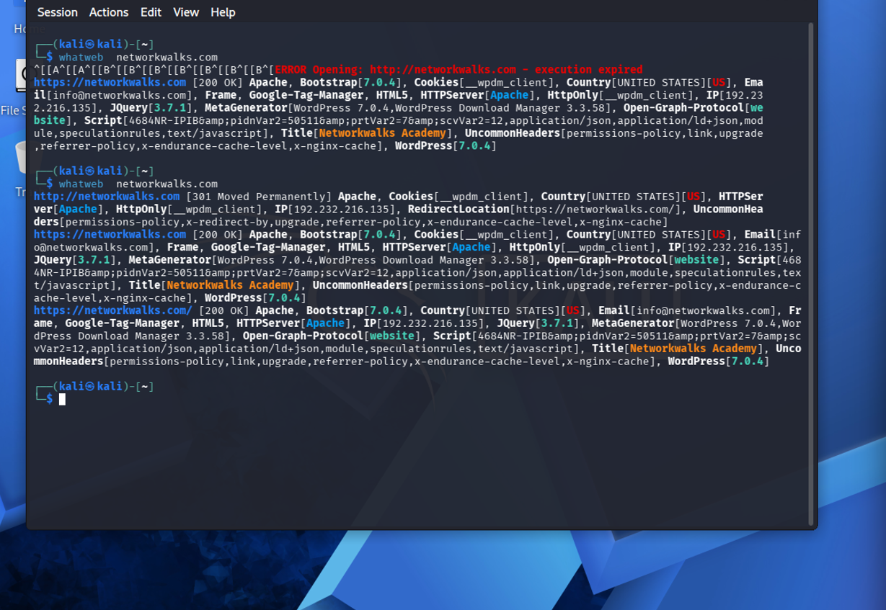
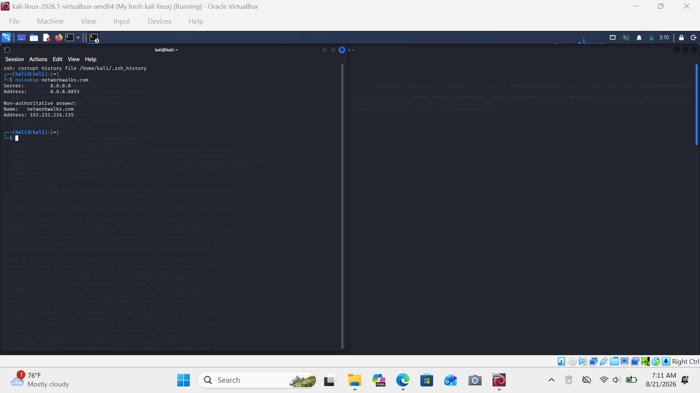
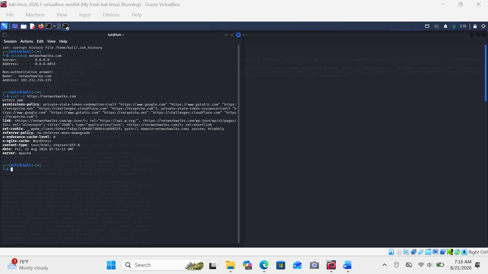
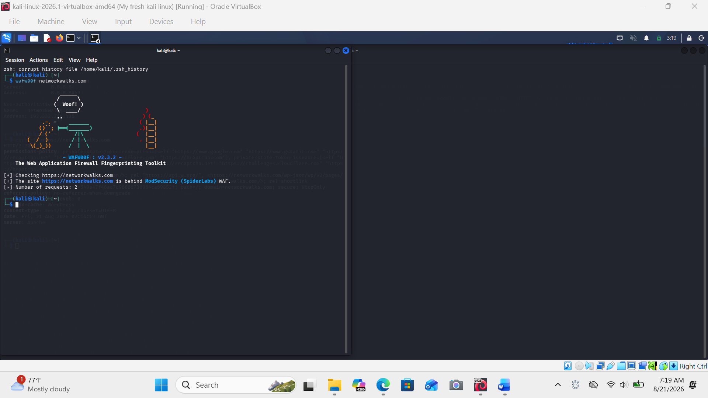
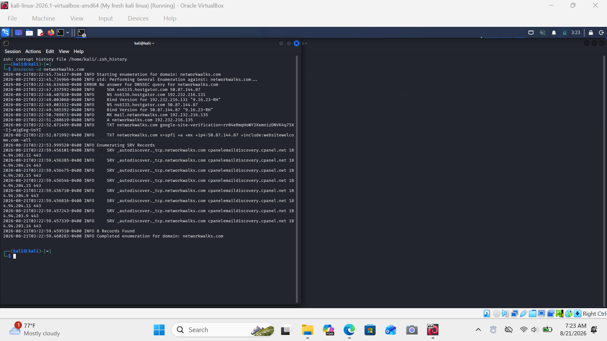
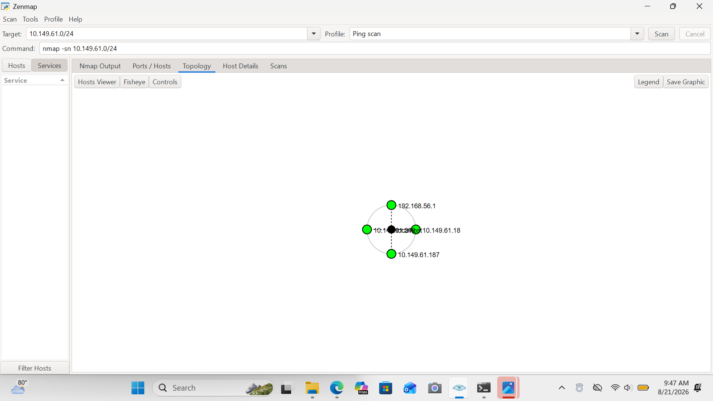
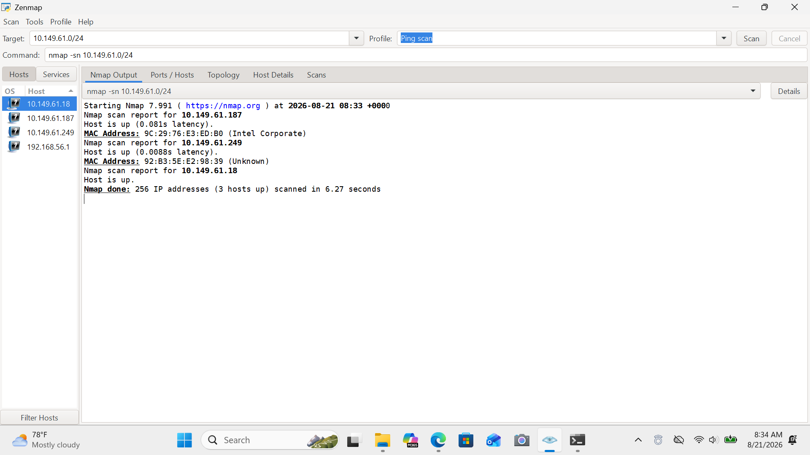
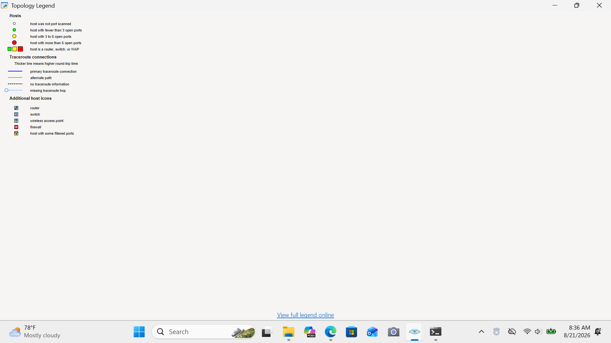

# networkwalks-BO82-week2-Cybersecurity-lab-setup
# 🔐 Week 2 — Cybersecurity & Ethical Hacking Labs

> **Hands-on Footprinting, Reconnaissance & Network Scanning**

This repository contains my **Week 2 practical cybersecurity projects** completed as part of my hands-on cybersecurity and ethical hacking training with **NetworkWalks**.

The week focused on two key areas of cybersecurity:

* 🔎 **Footprinting & Reconnaissance** using multiple Kali Linux tools
* 🌐 **Network Discovery & Scanning** using Zenmap/Nmap

These practical exercises provided hands-on experience with information gathering, DNS enumeration, web technology fingerprinting, HTTP analysis, WAF detection, host discovery, MAC address identification, and network topology visualization.

---

## 📋 Table of Contents

* [🎯 Week 2 Objectives](#-week-2-objectives)
* [🔎 Module 1 — Footprinting & Reconnaissance](#-module-1--footprinting--reconnaissance)

  * [Task 1 — WHOIS Enumeration](#task-1--whois-enumeration)
  * [Task 2 — Web Technology Fingerprinting](#task-2--web-technology-fingerprinting)
  * [Task 3 — DNS Resolution](#task-3--dns-resolution)
  * [Task 4 — HTTP Header Analysis](#task-4--http-header-analysis)
  * [Task 5 — WAF Detection](#task-5--waf-detection)
  * [Task 6 — DNS Enumeration](#task-6--dns-enumeration)
  * [Module 1 Summary](#module-1-summary)
* [🌐 Module 5 — Network Scanning with Zenmap](#-module-5--network-scanning-with-zenmap)

  * [Task 1 — Zenmap Installation](#task-1--zenmap-installation)
  * [Task 2 — Local Network Identification](#task-2--local-network-identification)
  * [Task 3 — Live Host Discovery](#task-3--live-host-discovery)
  * [Task 4 — Number of Live Hosts](#task-4--number-of-live-hosts)
  * [Task 5 — IP Addresses](#task-5--ip-addresses)
  * [Task 6 — MAC Addresses](#task-6--mac-addresses)
  * [Task 7 — Network Topology](#task-7--network-topology)
  * [Module 5 Summary](#module-5-summary)
* [🛠️ Tools & Technologies](#️-tools--technologies)
* [🧠 Skills Developed](#-skills-developed)
* [📊 Week 2 Summary](#-week-2-summary)
* [⚖️ Ethical & Legal Disclaimer](#️-ethical--legal-disclaimer)
* [🚀 Key Takeaways](#-key-takeaways)
* [👨🏽‍💻 Author](#-author)

---

# 🎯 Week 2 Objectives

The main objectives of this week's practical work were to:

* Understand the reconnaissance phase of ethical hacking
* Gather publicly available information about a target
* Perform domain and DNS enumeration
* Fingerprint web technologies
* Analyze HTTP response headers
* Detect Web Application Firewalls
* Identify a local network subnet
* Discover active hosts within a network
* Identify IP and MAC addresses
* Visualize network topology
* Document practical cybersecurity findings

The reconnaissance module introduces footprinting as an information-gathering stage in which different tools are used to build a profile of a target.

---

# 🔎 Module 1 — Footprinting & Reconnaissance

## 📌 Overview

Footprinting and reconnaissance involve collecting information about a target before performing further security testing.

In this practical module, I used six Kali Linux tools to investigate different aspects of the target domain:

| # | Tool       | Purpose                            |
| - | ---------- | ---------------------------------- |
| 1 | `whois`    | Domain registration information    |
| 2 | `whatweb`  | Web technology fingerprinting      |
| 3 | `nslookup` | DNS and IP resolution              |
| 4 | `curl`     | HTTP response header analysis      |
| 5 | `wafw00f`  | Web Application Firewall detection |
| 6 | `dnsrecon` | DNS record enumeration             |

The assignment specifically required these six reconnaissance activities and instructed that screenshots and command outputs be saved as evidence.

---

## Task 1 — WHOIS Enumeration

### 🎯 Objective

Query the public domain registration record to obtain available registration information and identify the domain's name servers.

### 💻 Command

```bash
whois networkwalks.com
```

### 📸 Result


### 🧠 What I Learned

The `whois` utility can provide publicly available domain registration information, including registration-related details and name server information.

This demonstrates how publicly exposed domain information can contribute to the reconnaissance process. The practical specifically identifies registration details and name servers as the focus of this task.

---

## Task 2 — Web Technology Fingerprinting

### 🎯 Objective

Identify technologies and software components associated with the target website.

### 💻 Command

```bash
whatweb networkwalks.com
```

### 📸 Result



### 🧠 What I Learned

WhatWeb can be used to fingerprint technologies exposed by a website.

The task focuses on identifying elements such as the web server, CMS, plugins, frameworks, and IP address.

This helped me understand how technology fingerprinting can provide useful information during the reconnaissance phase.

---

## Task 3 — DNS Resolution

### 🎯 Objective

Resolve the target domain name to its associated IP address using DNS.

### 💻 Command

```bash
nslookup networkwalks.com
```

### 📸 Result



### 🧠 What I Learned

`nslookup` can be used to query DNS information and determine how a domain name resolves to an IP address.

Understanding DNS resolution is useful during reconnaissance because it helps security professionals understand publicly exposed network infrastructure.

---

## Task 4 — HTTP Header Analysis

### 🎯 Objective

Inspect the HTTP response headers returned by the target website.

### 💻 Command

```bash
curl -I https://networkwalks.com
```

### 📸 Result



### 🧠 What I Learned

The `curl -I` command allows HTTP response headers to be inspected without retrieving the complete webpage.

The practical focuses on examining information such as server responses, headers, cookies, and redirects.

This exercise helped me understand how HTTP metadata can reveal useful information about a web application.

---

## Task 5 — Web Application Firewall Detection

### 🎯 Objective

Determine whether a Web Application Firewall (WAF) is protecting the target website.

### 💻 Command

```bash
wafw00f networkwalks.com
```

### 📸 Result



### 🧠 What I Learned

WAFW00F can be used to identify whether a web application is protected by a Web Application Firewall.

The exercise demonstrated how security analysts can identify defensive technologies that may be present in front of a web application.

---

## Task 6 — DNS Enumeration

### 🎯 Objective

Enumerate DNS records associated with the target domain.

### 💻 Command

```bash
dnsrecon -d networkwalks.com
```

### 📸 Result



### 🧠 What I Learned

DNSRecon can be used to enumerate DNS information such as name servers, mail servers, TXT/SPF records, and service records.

This exercise helped me understand how DNS records can provide additional visibility into the infrastructure associated with a domain.

---

# 📊 Module 1 Summary

| Task | Tool     | Activity                           | Evidence |
| ---- | -------- | ---------------------------------- | -------- |
| 1    | WHOIS    | Domain registration reconnaissance | ✅        |
| 2    | WhatWeb  | Web technology fingerprinting      | ✅        |
| 3    | Nslookup | DNS/IP resolution                  | ✅        |
| 4    | cURL     | HTTP header analysis               | ✅        |
| 5    | WAFW00F  | WAF detection                      | ✅        |
| 6    | DNSRecon | DNS enumeration                    | ✅        |

### 🔑 Module 1 Learning Outcome

This module demonstrated how multiple reconnaissance tools can provide different pieces of information about a target.

Instead of relying on one tool, combining several techniques provides a broader view of the target's publicly exposed information.

The training material emphasizes that reconnaissance can help both attackers understand a target and defenders understand what their own infrastructure exposes publicly.

---

# 🌐 Module 5 — Network Scanning with Zenmap

## 📌 Overview

The second practical module focused on **network scanning and host discovery using Zenmap**.

Zenmap is the graphical interface for Nmap and provides a way to perform Nmap scans through a graphical environment. The assignment also introduces its topology visualization and scanning profiles.

The module required identifying the local network, discovering active hosts, identifying their IP and MAC addresses, and generating a network topology.

---

## Task 1 — Zenmap Installation

### 🎯 Objective

Download, install, and launch Zenmap on Windows.

Zenmap was used as the graphical interface for the Nmap network scanning exercises.

### 🛠️ Tool

**Zenmap / Nmap**

---

## Task 2 — Local Network Identification

### 🎯 Objective

Identify the local network configuration and determine the subnet to be scanned.

### 🔍 Network Used

```text
Target Subnet: 10.149.61.0/24
```

### 💻 Scan Configuration

```text
Target: 10.149.61.0/24
Profile: Ping scan
Command: nmap -sn 10.149.61.0/24
```

The assignment instructs students to use their own local subnet because the subnet and results may differ depending on the network configuration.

---

## Task 3 — Live Host Discovery

### 🎯 Objective

Use Zenmap's Ping Scan profile to identify active hosts within the selected subnet.

### 💻 Command

```bash
nmap -sn 10.149.61.0/24
```

### 📸 Scan Result



### 📊 Result

The scan reported:

```text
Nmap done: 256 IP addresses (3 hosts up) scanned in 6.27 seconds
```

Therefore:

> **3 hosts were detected as active within the scanned `/24` subnet.**

---

## Task 4 — Number of Live Hosts

### 🎯 Result

The scan identified **3 live hosts**.

| # | IP Address      | Status |
| - | --------------- | ------ |
| 1 | `10.149.61.18`  | 🟢 Up  |
| 2 | `10.149.61.187` | 🟢 Up  |
| 3 | `10.149.61.249` | 🟢 Up  |

### 📸 Evidence


The Nmap output confirms that **256 IP addresses were scanned and 3 hosts were up**.

---

## Task 5 — IP Addresses of Live Hosts

### 🎯 Objective

Identify the IP addresses of the hosts discovered during the Ping Scan.

### 📍 Discovered Hosts

```text
10.149.61.18
10.149.61.187
10.149.61.249
```

### 📸 Evidence


These addresses were displayed in the Zenmap Hosts panel and Nmap output.

---

## Task 6 — MAC Addresses of Live Hosts

### 🎯 Objective

Identify the MAC addresses associated with the discovered hosts where available.

### 📊 Results

| IP Address      | MAC Address                      | Vendor          |
| --------------- | -------------------------------- | --------------- |
| `10.149.61.187` | `9C:29:76:E3:ED:B0`              | Intel Corporate |
| `10.149.61.249` | `92:B3:5E:E2:98:39`              | Unknown         |
| `10.149.61.18`  | Not displayed in captured output | —               |

### 📸 Evidence


### 🧠 Observation

MAC address information was available for two of the hosts in the captured Nmap output.

I have **not assumed a MAC address for `10.149.61.18`**, since it was not displayed in the captured result.

---

## Task 7 — Network Topology

### 🎯 Objective

Use Zenmap's topology visualization to view the discovered network and document the topology.

### 📸 Topology Result



The Zenmap topology view displayed the network nodes identified during the scanning process.

The topology also displayed `192.168.56.1` as a network node/interface visible in the visualization.

---

### 📖 Topology Legend

Zenmap provides a legend explaining the symbols and connections used in the topology visualization.



The legend was reviewed to understand how Zenmap represents different host states, traceroute connections, and additional network devices.

---

# 📊 Module 5 Summary

| Category                     | Result                    |
| ---------------------------- | ------------------------- |
| **Tool**                     | Zenmap / Nmap             |
| **Scan Profile**             | Ping Scan                 |
| **Command**                  | `nmap -sn 10.149.61.0/24` |
| **Target Subnet**            | `10.149.61.0/24`          |
| **IP Addresses Scanned**     | 256                       |
| **Hosts Up**                 | **3**                     |
| **Live Host 1**              | `10.149.61.18`            |
| **Live Host 2**              | `10.149.61.187`           |
| **Live Host 3**              | `10.149.61.249`           |
| **MAC Addresses Identified** | 2                         |
| **Topology Visualization**   | ✅ Completed               |
| **Topology Legend Reviewed** | ✅ Completed               |

---

# 🛠️ Tools & Technologies

## 🐧 Kali Linux / Reconnaissance

* WHOIS
* WhatWeb
* Nslookup
* cURL
* WAFW00F
* DNSRecon

## 🌐 Network Security

* Nmap
* Zenmap
* Windows Command Prompt
* `ipconfig`

## 💻 Concepts

* Footprinting
* Reconnaissance
* DNS Enumeration
* Web Fingerprinting
* HTTP Header Analysis
* WAF Detection
* Network Discovery
* Host Discovery
* IP Address Identification
* MAC Address Identification
* Network Topology

---

# 🧠 Skills Developed

## 🔎 Reconnaissance Skills

* Domain information gathering
* WHOIS analysis
* DNS enumeration
* Web technology fingerprinting
* HTTP response analysis
* WAF identification

## 🌐 Network Security Skills

* Subnet identification
* Ping scanning
* Live host discovery
* IP address analysis
* MAC address analysis
* Network topology visualization

## 💻 Technical Skills

* Kali Linux command-line operations
* Nmap/Zenmap usage
* DNS tools
* Web reconnaissance tools
* Network analysis
* Security evidence collection

## 📑 Documentation Skills

* Recording command outputs
* Capturing technical evidence
* Organizing cybersecurity findings
* Writing technical observations
* Presenting practical results in a structured format

---

# 📊 Week 2 Summary

| Module     | Focus                         | Main Tools                                        | Status      |
| ---------- | ----------------------------- | ------------------------------------------------- | ----------- |
| **W2-PM1** | Footprinting & Reconnaissance | WHOIS, WhatWeb, Nslookup, cURL, WAFW00F, DNSRecon | ✅ Completed |
| **W2-PM5** | Network Scanning              | Zenmap, Nmap, Windows CMD                         | ✅ Completed |

### Week 2 Progress

```text
Footprinting
     ↓
Domain Reconnaissance
     ↓
DNS Enumeration
     ↓
Web Technology Fingerprinting
     ↓
HTTP Analysis
     ↓
WAF Detection
     ↓
Network Discovery
     ↓
Live Host Identification
     ↓
Network Topology
```

This progression provided practical exposure to both **web reconnaissance** and **network reconnaissance**.

---

# 📸 Evidence Collected

## Module 1 — Reconnaissance

* ✅ WHOIS screenshot
* ✅ WhatWeb screenshot
* ✅ Nslookup screenshot
* ✅ cURL screenshot
* ✅ WAFW00F screenshot
* ✅ DNSRecon screenshot

## Module 5 — Zenmap

* ✅ Ping Scan output
* ✅ Live host results
* ✅ IP address results
* ✅ MAC address results
* ✅ Network topology screenshot
* ✅ Topology legend screenshot

---

# ⚖️ Ethical & Legal Disclaimer

> **This repository is intended strictly for educational, ethical hacking, and authorized cybersecurity testing purposes.**

The techniques demonstrated in this project should only be performed against systems, applications, and networks where appropriate authorization has been granted.

Unauthorized reconnaissance, scanning, enumeration, or security testing may violate organizational policies and applicable laws.

The practical training emphasizes that footprinting uses information exposed by a target and that defenders can use the same techniques to understand what information their own infrastructure reveals.

---

# 🚀 Key Takeaways

Week 2 strengthened my practical understanding of the **reconnaissance and network discovery stages of cybersecurity**.

Through the footprinting module, I learned how different tools can be combined to gather information about a target's:

* Domain registration
* Web technologies
* DNS infrastructure
* HTTP behavior
* Security controls
* DNS records

Through the network scanning module, I gained practical experience with:

* Identifying a subnet
* Performing a Ping Scan
* Discovering active hosts
* Identifying IP addresses
* Identifying available MAC addresses
* Visualizing network topology

Most importantly, these exercises helped me connect **cybersecurity theory with practical command-line and graphical security tools** while learning how to document technical findings professionally.

---

# 👨🏽‍💻 Author

## Maxwell Anaaba

**Computer Science & Engineering Student**
**Cybersecurity & Cloud Computing Enthusiast**

### 🔐 Areas of Interest

* Cybersecurity
* Security Operations (SOC)
* Network Security
* Cloud Security
* Ethical Hacking
* Governance, Risk & Compliance (GRC)

---

> **Learn. Practice. Secure. 🔐**

*Week 2 Cybersecurity & Ethical Hacking Practical Labs*
